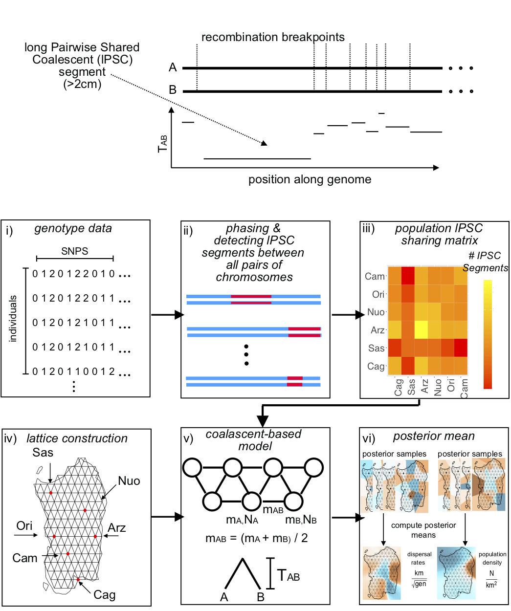

# Migration and Population Surface estimation (MAPS)

 

The MAPs software is built from the eems software and the software
usage is very similar. **Here, we only highlight the differences
between the usage of MAPs and EEMS**. Please see
https://github.com/dipetkov/eems for the usage in EEMS.

*The MAPS program has been tested with ...*

Please post bugs, questions and feature requests or suspected bugs to
[Github issues](https://github.com/halasadi/MAPS/issues).

## Citing this work

If you find the MAPS program, or any source code contained in this
repository, useful for your work, please cite:

> Add paper to cite here.

## License

Copyright (c) 2017-2018, Hussein Al-Asadi.

The software and example programs in this repository are made
available under the terms of the
[MIT license](https://opensource.org/licenses/mit-license.html).
See [LICENSE](LICENSE) for the full text of the license.

## Quick Start

Follow these steps to quickly get started using MAPS.

For installing the software dependencies, we provide detailed
instructions using the
[conda package manager](https://conda.io/docs). This is only a
recommended aproach---conda is not required to use MAPS, and other
approaches can be taken to install the dependencies (e.g., by directly
downloading the source code, or by using [Homebrew](http://brew.sh) for
Mac).

1. Install [GNU Make](https://www.gnu.org/software/make).

2. Install a [Conda](https://conda.io/docs) distribution such as
   [Anaconda](https://www.anaconda.com/download) or
   [Miniconda](https://conda.io/miniconda.html) (*optional*).

3. Create a new conda environment for MAPS (*optional*).

   ```bash
   conda create -n MAPS
   source activate MAPS
   ```
4. Install the [Boost](http://www.boost.org) C++ source libraries
   version 1.57.0. If using conda, run `conda install boost=1.57.0`.

5. Install the [Eigen](http://eigen.tuxfamily.org) C++ matrix algebra
   library. If using conda, run `conda install eigen`.

6. Clone or download this repository.

7. Adjust the Makefile variables as needed to suit your computing
   environment. See the instructions in the [Makefile](src/Makefile)
   for details. For example, if you installed the Boost and Eigen
   libraries with conda, then you would add the following flags to the
   `CXXFLAGS` and `LDFLAGS` settings, respectively (again, see the
   Makefile for full details):

   ```
   -I$(HOME)/anaconda/envs/MAPS/include
   -L$(HOME)/anaconda/envs/MAPS/lib
   ```

8. Run `make` in the [src](src) subdirectory to build the `runeems2`
   binary executable.

9. *Explain that the Boost library needs to be in the library search
   path.*

10. Try running MAPS on the 2-6 cM PSC segments provided in the
    examples/2_6 subdirectory.

   ```bash
   cd examples
   ../src/runeems2 --params params-test-2_6.ini
   ```

    It may take 10--30 minutes for the MCMC simulation to complete.

11. Next, try running MAPS on larger PSC segments (>6 cM) to
    investigate at more recent population structure.

    ```bash
    ../src/runeems2 --params params-test-6_Inf.ini
    ```

12. *Optionally*, install the
    [plotmaps](https://github.com/halasadi/plotmaps) package in R, and
    run the following code in R. This will generate plots for
    diagnosing and interprting the MAPS analyses of the shorter and
    longer PSC segments. The plots are saved as PDFs.

    ```R
    library(plotmaps)
    plot_maps(add.pts = TRUE, add.graph = TRUE, add.countries = FALSE,
         longlat = TRUE, mcmcpath = "2_6/2_6-MAPS-test-sim", 
         outpath = "2_6", width = 10, height = 6)
    plot_maps(add.pts = TRUE, add.graph = TRUE, add.countries = FALSE,
         longlat = TRUE, mcmcpath = "6_Inf/6_Inf-MAPS-test-sim", 
         outpath = "6_Inf", width = 10, height = 6, plot.difference=TRUE)
    ```

Continue reading for more detailed documentation on MAPS.

## Preparing data for MAPS

MAPS requires for input

* IBD sharing matrix (ends in .sims) (see below)
* coordinate file (ends in .coord). see eems documentation
* outer file (ends in .outer). see eems documentation

An IBD sharing matrix is required for MAPs (instead of an
disssimilarity matrix as in eems). The IBD sharing matrix ${X}$ is
defined such that $X_{i,j}$ is the number of IBD segments shared in a
length bin R between haploid $i$ and haploid $j$, the length bin or
range R is described below. In the MAPs paper we use the software
refinedIBD to call and phase diploid data. The sharing matrix must end
with with the prefix .sims, e.g. `popressard_2_Inf.sims`.

The length bin R is defined by a lowerbound and an upperbound on the
**cM** scale, and can be specified in the `params` file withe the
parameter `lowerBound` and `upperBound`. If `upperBound` entry is
blank, it is assumed to be infinity.

For example,
```
datapath = popressard_2_Inf.sims
lowerBound = 2
```

We also allow the capability to visualize IBD segments in a length
region, for example betweem 2cM and 8cM.  ``` datapath =
popressard_2_8.sims lowerBound = 2 upperBound = 8 ``` ## parameter
configuration

As mentioned above, the parameters in MAPs are nearly
identical. However, there are a few additional arguments in the
`params` file,

* `genomeSize` (optional defaults to 3000cM)

* `nIndiv` (required, number of haploid individuals)

* `lowerBound` (required, lower bound in cM)

* `upperBound` (optional defaults to infinity, upper bound in cM)

* `qrateMuProposalS2` (optional, acts in the same was as in mrateMuProposalS2 except for the coalescent rates)

* `olderpath` (optional, path to a run with a older time period, MAPS
               will only estimate the difference between rates from
               the older time period)

## Credits

This project was developed by
[Hussein Al-Asadi](https://github.com/halasadi) at the University of
Chicago.

Thanks to [Matthew Stephens](http://stephenslab.uchicago.edu) and
[John Novembre](http://jnpopgen.org) for their support and mentorship.
