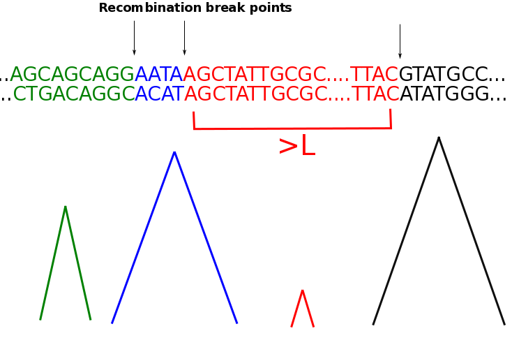
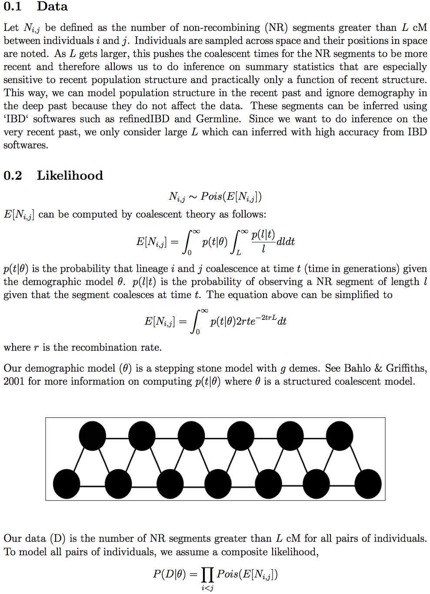
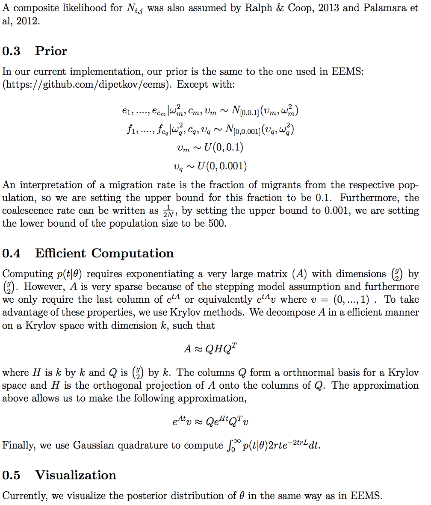

Inferring Recent Demographic Surfaces via Haplotyepe Sharing
=====================================

This in an internal repo.

## A quick summary

Long streches of sequence similarity are indicative of recent ancestry. Using coalescent theory, we model the number of these streches between individuals across space and infer a population size surface and migration surface.

*Long segments of similarity (>L) are indicative of short coalescent times*:

## A more detailed summary

